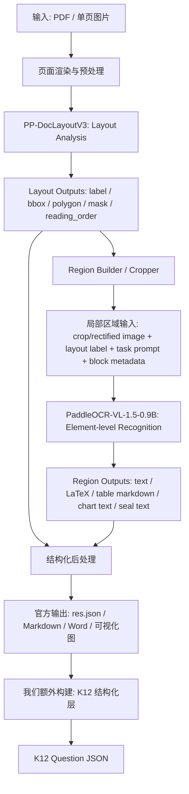
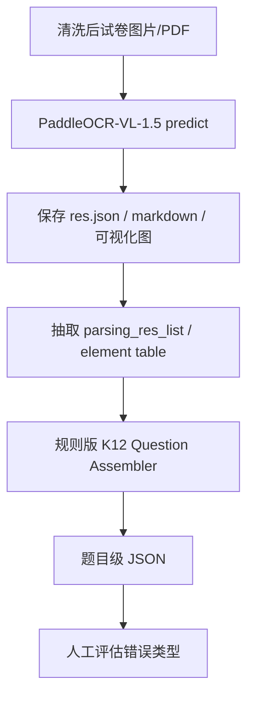

# 基于 PaddleOCR-VL-1.5 的 K12 试卷识别与解析流程说明

版本：v0.3  
用途：统一 PP-DocLayoutV3、PaddleOCR-VL-1.5-0.9B、结构化后处理与 K12 试卷结构化层的职责边界，并确定本次任务的大致流程。  
本版重点修正：**补充“若微调 PP-DocLayoutV3 标注 question_block / option_block 等 K12 专用区域，后续结构化层是否仍然需要”的判断；同时继续明确 PP-DocLayoutV3 的输出不仅用于最终后处理，也会作为 PaddleOCR-VL-1.5-0.9B 的输入构造依据**。

---

## 0. 本版关键结论

1. **PaddleOCR-VL-1.5** 指完整文档解析系统 / pipeline，不等同于内部的 0.9B VLM。
2. **PP-DocLayoutV3** 是页面级 layout engine，负责版面元素检测、定位、实例分割和阅读顺序预测。
3. **PaddleOCR-VL-1.5-0.9B** 是元素级识别 VLM，在 document parsing 模式下通常不是直接吃整页，而是吃 **PP-DocLayoutV3 定位出的局部区域 crop / rectified region + task prompt**。
4. **结构化后处理** 将 layout 结果与 0.9B VLM 的区域识别结果合并为官方的 Markdown / JSON。
5. **K12 结构化层 / Question Assembler** 是我们额外构建的业务层。它使用 layout primitive + region-level recognition result，生成题目级 JSON。
6. 第一阶段不建议直接训练端到端模型。建议先冻结 PaddleOCR-VL-1.5，抽取元素表，再训练或实现外部 K12 结构化层。
7. 如果微调 PP-DocLayoutV3 并标注 `question_block`，可以显著简化“切题”逻辑，但不能完全取消 K12 结构化层；更推荐做 **原始版面元素 + K12 语义容器** 的双层 layout 输出。

---

## 1. 术语统一

本文后续统一使用以下名称。

| 名称 | 含义 | 是否属于完整系统 | 核心职责 |
|---|---|---:|---|
| **PaddleOCR-VL-1.5** | 完整文档解析 pipeline / 系统 | 是 | 页面级文档解析：页面渲染、版面分析、区域裁剪、元素级识别、阅读顺序合并、Markdown/JSON 输出、跨页表格合并、标题层级重构等 |
| **PP-DocLayoutV3** | PaddleOCR-VL-1.5 内部的 layout engine | 否，属于第一阶段模块 | 检测并定位页面中的版面元素，输出元素类别、坐标、多边形/异形框、mask/segment、阅读顺序；同时为 0.9B VLM 构造局部区域输入；若做 K12 微调，可新增 `question_block`、`option_block`、`answer_area` 等语义容器标签 |
| **Region Builder / Cropper** | layout 与 VLM 之间的桥接模块 | 是，属于 pipeline 中间环节 | 根据 PP-DocLayoutV3 输出的 bbox/polygon/mask 裁剪或校正局部区域，并根据 block label 决定 VLM task prompt |
| **PaddleOCR-VL-1.5-0.9B** | PaddleOCR-VL-1.5 内部的 0.9B VLM | 否，属于第二阶段模块 | 对局部区域图像进行 OCR、公式、表格、图表、印章识别；在 Spotting 模式下也可做文本检测 + 识别 |
| **结构化后处理 / post-processing** | 完整 pipeline 末端的结果组织模块 | 是，属于 pipeline 层 | 将 layout 元素和 VLM 识别结果按阅读顺序合并为 Markdown/JSON，并处理跨页表格、标题层级等文档级结构 |
| **K12 结构化层 / Question Assembler** | 我们需要额外构建的业务层 | 否，外接模块 | 将通用文档元素转为 K12 题目对象：大题、题号、题干、选项、图片选项、跨页题、题型、知识点等 |

关键结论：**PaddleOCR-VL-1.5 是完整 pipeline；PaddleOCR-VL-1.5-0.9B 只是其中的 VLM 组件。不能把 0.9B VLM 单独等同于完整 PaddleOCR-VL-1.5。**

---

## 2. PaddleOCR-VL-1.5 的整体数据流

PaddleOCR-VL-1.5 的 document parsing 模式可以理解为四段：

```text
页面输入
  → PP-DocLayoutV3 版面分析
  → Region Builder / Cropper 构造局部区域输入
  → PaddleOCR-VL-1.5-0.9B 区域级识别
  → 结构化后处理输出 Markdown / JSON
```

需要特别强调：**PP-DocLayoutV3 的输出会进入 0.9B VLM 的输入链路**。也就是说，layout 阶段不是只给最后的后处理用，它首先决定了 0.9B VLM 看哪些区域、按什么顺序看、以什么任务类型识别。



对于 PDF，官方接口通常是**逐页处理**。若需要跨页表格合并、标题层级重构或多页结果合并，可调用 `pipeline.restructure_pages(...)`。这说明 PaddleOCR-VL-1.5 的跨页能力主要在 pipeline 后处理层，而不是 0.9B VLM 一次性读取整份 PDF。

---

## 3. PP-DocLayoutV3 的职责、输入与输出

### 3.1 职责

PP-DocLayoutV3 是 layout engine。它负责从整页图像中识别版面元素，并给出几何定位和阅读顺序。

它应该负责：

```text
1. 版面元素检测：Text / Number / Image / Table / Formula / Chart / Seal / Title 等
2. 多点框或异形区域定位：polygon / irregular bounding box
3. 实例分割：mask / pixel-level segment
4. 阅读顺序预测：reading order
5. 为 VLM 阶段提供元素级裁剪区域
6. 为后处理和 K12 结构化层提供页面空间结构依据
```

它不应该直接负责：

```text
1. 判断某个元素是否为第 N 题
2. 判断某张图片属于 A 选项还是题干
3. 判断题型、知识点、难度
4. 生成完整 K12 题目 JSON
5. 生成最终 Markdown / Word
```


如果针对 K12 试卷微调 PP-DocLayoutV3，可以把它的职责从“通用版面元素检测”扩展为“通用版面元素 + K12 语义容器检测”。这里的关键点是：**不要只保留 `question_block`，也不要用 `question_block` 替代原始文本、公式、表格、图片等元素检测**。

推荐目标是双层 layout：

```text
A. 原始版面元素层：
   text / number / image / table / display_formula / inline_formula / chart / seal / title ...

B. K12 语义容器层：
   section_title / question_block / subquestion_block / stem_block / option_block /
   option_label / option_image / stem_figure / answer_area / analysis_block ...
```

其中：

```text
原始版面元素层 → 继续用于给 0.9B VLM 构造元素级 crop / rectified region。
K12 语义容器层 → 用于简化切题、选项归属、答题区定位和 page_spans 构造。
```


### 3.2 输入

```json
{
  "page_image": "rendered_page.png",
  "page_index": 1,
  "image_width": 2480,
  "image_height": 3508,
  "preprocessing": {
    "orientation_classified": true,
    "unwarping_applied": false,
    "handwriting_erased": true
  }
}
```

### 3.3 输出：layout primitive

论文中对 PP-DocLayoutV3 的输出描述是：类别标签、边界框坐标、像素级 segments 和逻辑阅读顺序。官方 pipeline 的结构化结果中也会出现 `parsing_res_list`，其元素包含 `block_bbox`、`block_label`、`block_content`、`block_id`、`block_order` 等字段。

建议我们在工程中将 PP-DocLayoutV3 的中间输出统一整理为下面的内部 schema：

```json
{
  "page_id": "paper_001_p001",
  "image_size": {
    "width": 2480,
    "height": 3508
  },
  "layout_elements": [
    {
      "element_id": "p001_e0001",
      "layout_type": "paragraph_title",
      "raw_label": "Paragraph Title",
      "score": 0.982,
      "geometry": {
        "polygon": [[120, 210], [2310, 210], [2310, 285], [120, 285]],
        "bbox_xyxy": [120, 210, 2310, 285],
        "mask_ref": null
      },
      "reading_order": 1,
      "content": {
        "text": "一、选择题（本大题共10小题，每小题3分，共30分）",
        "producer": "vlm_or_ocr_after_layout",
        "confidence": 0.971
      }
    },
    {
      "element_id": "p001_e0002",
      "layout_type": "number",
      "raw_label": "Number",
      "score": 0.944,
      "geometry": {
        "polygon": [[125, 330], [176, 330], [176, 374], [125, 374]],
        "bbox_xyxy": [125, 330, 176, 374],
        "mask_ref": null
      },
      "reading_order": 2,
      "content": {
        "text": "1.",
        "producer": "vlm_or_ocr_after_layout",
        "confidence": 0.963
      }
    }
  ]
}
```

注意：这里的 `content.text` 不是 PP-DocLayoutV3 自己的原始职责，而是后续 OCR/VLM 阶段回填到 element 上的结果。这样做是为了让 K12 结构化层能直接使用元素文本。

### 3.4 PP-DocLayoutV3 输出的两条流向

PP-DocLayoutV3 的输出有两条重要流向：

```text
流向 A：进入 Region Builder / Cropper
  layout element → crop/rectified region → 0.9B VLM 输入

流向 B：进入结构化后处理 / K12 Question Assembler
  layout element + reading_order + region content → Markdown/JSON 或 K12 Question JSON
```

因此，PP-DocLayoutV3 不是单纯的“可视化检测器”，而是完整 pipeline 的空间组织核心。

---

## 4. Region Builder / Cropper：PP-DocLayoutV3 与 0.9B VLM 的桥接层

这是 v0.2 新增的关键部分。

### 4.1 职责

Region Builder / Cropper 负责把 PP-DocLayoutV3 的 layout primitive 转换成 0.9B VLM 可消费的输入。

它负责：

```text
1. 根据 bbox/polygon/mask 裁剪元素区域
2. 对倾斜、弯曲或异形区域做几何校正或局部 rectification
3. 根据 layout_type 选择识别任务：OCR / Formula / Table / Chart / Seal 等
4. 构造 task prompt
5. 保留 block_id、reading_order、bbox/polygon 等 metadata，供后处理回填
6. 将多个页面的 content blocks 动态组成 mini-batch 送入 VLM inference
```

### 4.2 输入

```json
{
  "layout_element": {
    "element_id": "p001_e0007",
    "layout_type": "table",
    "geometry": {
      "polygon": [[120, 640], [2280, 640], [2280, 1180], [120, 1180]],
      "bbox_xyxy": [120, 640, 2280, 1180],
      "mask_ref": "mask_p001_e0007"
    },
    "reading_order": 7,
    "score": 0.953
  },
  "page_image": "paper_001_p001.png"
}
```

### 4.3 输出：给 0.9B VLM 的区域级输入

```json
{
  "region_id": "p001_b0007",
  "source_layout_element_id": "p001_e0007",
  "crop_image": "crops/p001_b0007.png",
  "rectified_image": "rectified/p001_b0007.png",
  "layout_label": "table",
  "task": "table",
  "prompt": "Table Recognition:",
  "bbox_xyxy": [120, 640, 2280, 1180],
  "polygon": [[120, 640], [2280, 640], [2280, 1180], [120, 1180]],
  "reading_order": 7,
  "page_id": "paper_001_p001"
}
```

### 4.4 任务映射示例

| layout_type / raw_label | VLM task | prompt 示例 | 说明 |
|---|---|---|---|
| Text / Content / Paragraph Title / Number | OCR | `OCR:` | 识别普通文本、题号、大题标题、段落标题 |
| Display Formula / Inline Formula | Formula Recognition | `Formula Recognition:` | 输出 LaTeX 或公式文本 |
| Table | Table Recognition | `Table Recognition:` | 输出表格 Markdown / HTML-like 结构 |
| Chart | Chart Recognition | `Chart Recognition:` | 输出图表解析文本 |
| Seal | Seal Recognition | `Seal Recognition:` | 输出印章文字 |
| Image | 通常不一定进入 VLM；视任务决定 | OCR / Chart / none | K12 中图形题图片通常应保留 crop，而不是强制识别成文本 |

注意：以上映射是工程建议，具体实现需要以 PaddleOCR-VL-1.5 开源代码中的实际 task routing 为准。

---

## 5. PaddleOCR-VL-1.5-0.9B 的职责、输入与输出

### 5.1 职责

PaddleOCR-VL-1.5-0.9B 是内部 VLM，负责对元素级图像区域进行识别。根据论文与 Hugging Face 模型说明，它支持以下任务：

```text
ocr       文本识别
formula   公式识别
table     表格识别
chart     图表识别
seal      印章识别
spotting  文本定位 + 文本识别
```

### 5.2 输入：需要区分 document parsing 模式与 standalone 模式

#### 5.2.1 Document parsing 模式

在完整 PaddleOCR-VL-1.5 pipeline 中，0.9B VLM 的输入来自 PP-DocLayoutV3 之后的 Region Builder / Cropper。

也就是说，此时 0.9B VLM 的典型输入不是“完整试卷页 → 输出整页题目 JSON”，而是：

```text
局部区域图像 crop / rectified region
+ task prompt
+ layout metadata
```

典型输入形式：

```json
{
  "region_id": "p001_b0003",
  "source_layout_element_id": "p001_e0003",
  "crop_image": "crops/p001_b0003.png",
  "layout_label": "text",
  "bbox_xyxy": [180, 326, 2260, 430],
  "polygon": [[180, 326], [2260, 326], [2260, 430], [180, 430]],
  "reading_order": 3,
  "task": "ocr",
  "prompt": "OCR:"
}
```

#### 5.2.2 Standalone / Transformers 模式

Hugging Face 示例中，用户可以直接给 0.9B VLM 一个图像和任务 prompt。

```python
PROMPTS = {
    "ocr": "OCR:",
    "table": "Table Recognition:",
    "formula": "Formula Recognition:",
    "chart": "Chart Recognition:",
    "spotting": "Spotting:",
    "seal": "Seal Recognition:",
}
```

这种模式主要适合 element-level recognition 和 text spotting，不等同于完整 page-level document parsing pipeline。

#### 5.2.3 Text Spotting 模式

Text Spotting 是一个特殊任务。它可以直接让 0.9B VLM 在输入图像中同时输出文本和位置 token。这个模式不一定需要 PP-DocLayoutV3 先切页面元素。

### 5.3 输出

0.9B VLM 的直接输出是**自回归生成结果**。在 Transformers 示例中，模型通过 `model.generate(...)` 生成 token 序列，再通过 `processor.decode(...)` 解码成字符串。

可以按任务理解为：

| 任务 | 输出形式 | 示例 |
|---|---|---|
| OCR | 普通文本字符串 | `下列图形中，既是轴对称图形又是中心对称图形的是（ ）` |
| Formula | LaTeX 或公式文本 | `\frac{1}{2}x + 3 = 7` |
| Table | 表格文本结构，通常进入 Markdown/HTML-like 表达 | `| 列1 | 列2 | ... |` |
| Chart | 图表解析结果文本 | `...` |
| Seal | 印章文字 | `某某学校教务处` |
| Spotting | 文本 + 位置 token | `DREAM <LOC_253> <LOC_286> ...` |

Text Spotting 的输出形式在论文中写得最明确：模型将识别文本和 8 个位置 token 拼接生成，8 个位置 token 对应四点框的 TL/TR/BR/BL 坐标。

```text
DREAM <LOC_253> <LOC_286> <LOC_346> <LOC_298> <LOC_345> <LOC_339> <LOC_252> <LOC_330>
```

因此，0.9B VLM 的“原始输出”应理解为：**生成式 token/text 输出**，而不是已经完成 K12 题目切分后的 JSON。

### 5.4 Document parsing 模式下的区域级识别结果

在完整 pipeline 中，0.9B VLM 的输出通常会回填到 layout block 上，形成类似下面的区域级结果：

```json
{
  "block_id": "p001_b0003",
  "source_layout_element_id": "p001_e0003",
  "block_label": "text",
  "block_bbox": [180, 326, 2260, 430],
  "block_order": 3,
  "vlm_task": "ocr",
  "raw_generation": "下列图形中，既是轴对称图形又是中心对称图形的是（ ）",
  "block_content": "下列图形中，既是轴对称图形又是中心对称图形的是（ ）"
}
```

对 K12 来说，最有价值的不是 VLM logits，而是这种 **layout metadata + region-level content** 的结合体。

### 5.5 对 K12 的意义

0.9B VLM 对 K12 试卷有价值的部分：

```text
1. 识别题干文本
2. 识别选项文本
3. 识别公式 LaTeX
4. 识别表格内容
5. 识别图片中的文字或图表说明
6. 在 spotting 任务中提供文本位置 token
```

它不天然输出：

```text
1. question_id
2. section_id
3. question_type
4. option owner
5. cross-page question linking
6. knowledge_points
```

这些需要 K12 结构化层完成。

---

## 6. 官方结构化输出：res.json、res.img、markdown、prunedResult

### 6.1 Python API 输出

官方 Python API 使用：

```python
from paddleocr import PaddleOCRVL

pipeline = PaddleOCRVL()
output = pipeline.predict("./paddleocr_vl_demo.png")
for res in output:
    res.print()
    res.save_to_json(save_path="output")
    res.save_to_markdown(save_path="output")
    res.save_to_word(save_path="output")
```

官方说明中，`res.json` 是结构化预测结果，和 `save_to_json()` 保存的内容一致。

### 6.2 res.json 的核心字段

官方结果说明中提到的关键字段包括：

```text
doc_preprocessor_res      文档预处理结果
model_settings            模型配置，例如是否启用方向分类、文档矫正
parsing_res_list          解析结果列表，顺序代表解析后的阅读顺序
  ├─ block_bbox           layout 区域 bbox
  ├─ block_label          layout 区域标签，例如 text、table 等
  ├─ block_content        区域内容
  ├─ block_id             区域编号
  └─ block_order          区域阅读顺序
```

这说明 `res.json` 对我们有直接价值：它已经接近“元素表”。但它是否保留足够多的多边形、mask、element crop、VLM raw text，需要实际跑代码确认。

### 6.3 res.img

`res.img` 是可视化图像字典，官方说明中可能包含：

```text
layout_det_res
整体 OCR 可视化图
text_paragraphs_ocr_res
formula_res_region1
table_cell_img
seal_res_region1
```

其用途主要是 debug 和可视化，不建议作为训练 K12 结构化层的主输入。

### 6.4 markdown

`res.markdown` 是 Markdown 结果字典，官方说明包括：

```text
markdown_texts
markdown_images
page_continuation_flags
```

它适合做最终展示或 LLM/RAG 输入，但不适合作为 K12 切题的唯一输入，因为 Markdown 可能丢失 element_id、局部 bbox、图文归属等结构信息。

### 6.5 服务化接口中的 prunedResult

服务化接口返回结构中存在：

```json
{
  "result": {
    "layoutParsingResults": [
      {
        "prunedResult": {},
        "markdown": {},
        "outputImages": {},
        "inputImage": "..."
      }
    ],
    "dataInfo": {}
  }
}
```

`prunedResult` 可以理解为服务端返回的简化结构化结果。它不是 PP-DocLayoutV3 的 raw tensor，也不是 0.9B VLM 的 raw generation token；它仍然是 pipeline 后处理后的用户级结果。

---

## 7. 我们是否需要 0.9B VLM 的原始输出？

这里要区分三种“原始输出”。

| 类型 | 含义 | 是否建议第一阶段使用 |
|---|---|---:|
| VLM 解码字符串 | `model.generate()` 后 `decode()` 得到的文本、LaTeX、表格文本、spotting LOC 序列 | 可用，但不一定必须 |
| VLM token ids / logits | 自回归解码前后的 token id、logits、hidden states | 第一阶段不建议 |
| Pipeline 结构化结果 | `res.json`、`parsing_res_list`、`block_content` 等 | 第一阶段建议优先使用 |

### 7.1 使用 VLM 原始解码输出的优点

```text
1. 可以拿到更接近模型生成的内容，减少后处理信息损失。
2. 对 spotting 任务，可以解析 <LOC_xxx> 坐标 token。
3. 对公式、表格、印章等任务，可以保留任务级原始字符串，便于错误分析。
4. 如果 pipeline 后处理对 K12 不合适，可以绕过部分通用后处理。
```

### 7.2 使用 VLM 原始解码输出的缺点

```text
1. 工程复杂度更高，需要截取 region-level 输入输出。
2. 原始输出是字符串/token，不是题目 JSON，还要继续解析。
3. 不一定包含 page-level 结构，因为 0.9B VLM 通常只看元素 crop。
4. 如果直接使用 token/logits/hidden states，训练和部署复杂度显著增加。
5. 原始输出经过 decode 后已经是离散文本，外部结构化层无法通过它把梯度传回 VLM。
```

### 7.3 不使用 VLM 原始输出，仅使用 res.json 的优点

```text
1. 快速启动，工程简单。
2. 结果稳定，接口明确。
3. 便于快速构建 K12 结构化层。
4. 不需要改 PaddleOCR-VL-1.5 内部代码。
5. 适合先做 200–500 页试卷 benchmark 和误差分析。
```

### 7.4 不使用 VLM 原始输出的缺点

```text
1. 可能丢失 element_id、polygon、mask 或 region crop 等细粒度信息。
2. Markdown 可能合并或重排内容，导致题目 bbox、选项归属不稳定。
3. 如果 res.json 只保留 block_bbox 而不保留 polygon/mask，图片选项归属可能精度不足。
4. 如果 block_content 已被通用后处理改写，难以定位 VLM 原始识别错误。
```

### 7.5 推荐策略

第一阶段建议：

```text
优先使用 PaddleOCR-VL-1.5 pipeline 的 res.json / parsing_res_list。
同时尽量导出或保留 layout primitive：element_id、block_bbox、block_label、block_content、block_order。
如果 res.json 不够细，再进入代码中截取 PP-DocLayoutV3 输出和 VLM region-level decoded output。
不建议第一阶段使用 logits / hidden states。
```

换句话说：**我们需要的是“元素级结构化结果”，不一定需要 0.9B VLM 的 raw logits。**

---

## 8. 如果外部训练 K12 结构化层，梯度传播会不会困难？

### 8.1 结论

如果冻结 PaddleOCR-VL-1.5，然后在外部训练一个 K12 结构化层，**梯度不需要回传到 PP-DocLayoutV3 或 0.9B VLM**。这不是缺陷，而是模块化系统的正常训练方式。

外部 K12 结构化层的输入是：

```text
layout element list + OCR/VLM content + bbox/polygon + reading order
```

输出是：

```text
question JSON / element ownership / option grouping / cross-page linking
```

训练时只更新 K12 结构化层的参数。

### 8.2 为什么不需要端到端梯度

PaddleOCR-VL-1.5 的输出大多是离散结构：

```text
block_label
block_content
block_order
text string
LaTeX string
Markdown string
```

离散文本和后处理规则本身不可微。即使拿到 VLM 解码字符串，也无法自然地通过 JSON 解析和规则合并把梯度传回 VLM。

因此，如果目标是训练“题目结构组装器”，更合理的是把 PaddleOCR-VL-1.5 当作冻结的感知前端，训练后端结构化模型。

### 8.3 什么时候需要微调 PaddleOCR-VL-1.5

只有当错误主要来自感知前端时，才需要微调 PP-DocLayoutV3 或 0.9B VLM。

需要微调 PP-DocLayoutV3 的情况：

```text
1. 题号、选项标签、图片、公式经常漏检
2. 题目区域中的图文元素定位明显错误
3. 弯曲、倾斜、擦除手写后的页面导致 layout 不稳定
4. K12 专用元素，如 option_image、answer_area、subquestion_number，需要直接被检测出来
```

需要微调 0.9B VLM 的情况：

```text
1. 题干 OCR 错误率高
2. 数学公式 LaTeX 识别错误多
3. 表格或图表内容识别不稳定
4. 印刷体 K12 特殊符号、上下标、括号、选项格式经常错
```

如果主要错误是：

```text
图片属于哪个选项
跨页题是否合并
题目属于哪个大题
题型判断
```

则应优先训练 K12 结构化层，而不是微调 0.9B VLM。

---


## 9. 如果微调 PP-DocLayoutV3 标注 question_block，结构化层是否还需要？

### 9.1 结论

如果微调 PP-DocLayoutV3，并且把每道题的完整范围 `question_block` 都标注好，那么原本依赖题号锚点、阅读顺序和几何规则的“切题”步骤会大幅简化。

但这不等于后面的 K12 结构化层可以完全删除。更准确的判断是：

```text
PP-DocLayoutV3 微调后可以解决“题目区域在哪里”。
K12 结构化层仍然需要解决“题目内部结构是什么、元素之间是什么关系”。
```

也就是说：

```text
如果只检测 question_block：
  可以省掉大部分题目 bbox 生成逻辑；
  但仍然需要题号、所属大题、题干、选项、图片归属、题型、跨页关系、知识点等结构化逻辑。

如果检测 question_block + option_block + stem_block + option_image：
  可以进一步简化结构化层；
  但仍然需要一个轻量 assembler 根据空间包含、阅读顺序和 element_id 生成最终 JSON。

如果想完全取消结构化层：
  那就不是单纯微调 PP-DocLayoutV3，而是需要训练端到端 JSON 生成模型或关系图预测模型。
```

### 9.2 只标注 question_block 能省掉什么？

如果 PP-DocLayoutV3 能直接输出每道题的 `question_block`，则下面这些模块可以大幅削弱或转为兜底逻辑：

```text
1. 根据题号识别题目起点
2. 根据下一个题号判断上一题结束
3. 单页 question fragment 的大部分生成逻辑
4. 普通题目的 bbox 合并逻辑
5. 一部分双栏/多栏切题规则
```

原来的流程：

```text
题号锚点 → 阅读顺序 → 元素聚合 → question bbox
```

可以变成：

```text
K12-enhanced PP-DocLayoutV3 → question_block polygon / bbox
```

这会明显提升切题稳定性，尤其适合：

```text
1. 双栏或多栏试卷
2. 图文混排题
3. 题号不明显或题号被擦除/污染的页面
4. 图片选项较多的选择题
5. 长材料题、阅读题、实验探究题
```

### 9.3 只标注 question_block 不能解决什么？

`question_block` 只是题目容器。它不能自动给出完整 K12 JSON。

仍然需要处理：

```text
1. question_number：题号是多少
2. section_id：属于哪个大题
3. stem：题干是哪一部分
4. options：A/B/C/D 分别是什么
5. option_image：哪张图属于哪个选项
6. formulas / tables / figures：公式、表格、图片属于题干还是选项
7. question_type：单选、填空、解答、证明、材料题等
8. is_cross_page / page_spans：是否跨页以及跨页片段如何合并
9. knowledge_points：知识点标注
```

因此，微调 PP-DocLayoutV3 后，K12 结构化层不会消失，而是从“复杂推理式切题系统”降级为“轻量关系装配器”。

### 9.4 为什么不能只输出 question_block？

在 PaddleOCR-VL-1.5 的 document parsing 模式下，PP-DocLayoutV3 的输出会进入 Region Builder / Cropper，再构造给 0.9B VLM 的局部区域输入。0.9B VLM 更适合处理元素级区域，例如文本块、公式块、表格块、印章块，而不是直接处理整道题的大 crop。

如果 PP-DocLayoutV3 只输出 `question_block`，可能带来以下问题：

```text
1. 整道题 crop 太大，包含题干、选项、图片、公式、空白答题区等混合内容。
2. 公式、表格、图片不再被单独裁剪，0.9B VLM 的识别稳定性可能下降。
3. 题干图和选项图的归属关系仍然不明确。
4. 对图片选项、公式选项、图文混合选项不友好。
5. 后续如果要计算题目 bbox、选项 bbox 和元素 provenance，会缺少细粒度 element_id。
```

因此，不建议用 `question_block` 替代原始版面元素检测。正确做法是双层输出：

```text
question_block 用来确定题目容器；
text / formula / table / image 等原始元素继续用于 0.9B VLM 识别和题内结构装配。
```

### 9.5 推荐的 K12-enhanced PP-DocLayoutV3 输出类别

如果要微调 PP-DocLayoutV3，建议增加 K12 专用标签，但保留原始通用标签。

最低推荐标签集：

```text
section_title        大题标题
question_block       整题范围
question_number      题号
option_label         A/B/C/D、①②③④ 等选项标签
option_block         每个选项的整体区域
stem_figure          题干共享图片
option_image         选项图片
answer_area          答题区
subquestion_number   小题号，例如 21(1)、21(2)
```

如果标注成本允许，可进一步增加：

```text
stem_block           题干区域
subquestion_block    子题范围
analysis_block       解析区
answer_block         标准答案区
material_block       阅读材料/背景材料
```

仍需保留或复用通用版面标签：

```text
text
number
image
table
display_formula
inline_formula
chart
seal
paragraph_title
```

### 9.6 K12-enhanced layout 输出示例

微调后的 PP-DocLayoutV3 可以输出类似下面的 layout primitive。注意这里仍然是平铺的 detection/segmentation instance list，不是最终题目 JSON。

```json
{
  "page_id": "paper_001_p001",
  "layout_elements": [
    {
      "element_id": "p001_e001",
      "layout_type": "section_title",
      "score": 0.98,
      "geometry": {
        "bbox_xyxy": [120, 210, 2310, 285],
        "polygon": [[120, 210], [2310, 210], [2310, 285], [120, 285]]
      },
      "reading_order": 1
    },
    {
      "element_id": "p001_e002",
      "layout_type": "question_block",
      "score": 0.96,
      "geometry": {
        "bbox_xyxy": [120, 326, 2260, 1040],
        "polygon": [[120, 326], [2260, 326], [2260, 1040], [120, 1040]]
      },
      "reading_order": 2
    },
    {
      "element_id": "p001_e003",
      "layout_type": "question_number",
      "score": 0.94,
      "geometry": {
        "bbox_xyxy": [125, 330, 176, 374],
        "polygon": [[125, 330], [176, 330], [176, 374], [125, 374]]
      },
      "reading_order": 3
    },
    {
      "element_id": "p001_e004",
      "layout_type": "text",
      "score": 0.97,
      "geometry": {
        "bbox_xyxy": [180, 326, 2260, 430],
        "polygon": [[180, 326], [2260, 326], [2260, 430], [180, 430]]
      },
      "reading_order": 4
    },
    {
      "element_id": "p001_e005",
      "layout_type": "option_block",
      "score": 0.93,
      "geometry": {
        "bbox_xyxy": [125, 735, 575, 1040],
        "polygon": [[125, 735], [575, 735], [575, 1040], [125, 1040]]
      },
      "reading_order": 5
    },
    {
      "element_id": "p001_e006",
      "layout_type": "option_image",
      "score": 0.92,
      "geometry": {
        "bbox_xyxy": [180, 805, 520, 1040],
        "polygon": [[180, 805], [520, 805], [520, 1040], [180, 1040]]
      },
      "reading_order": 6
    }
  ]
}
```

后续 K12 Assembler 再基于空间包含和阅读顺序生成：

```json
{
  "question_id": "paper_001_q001",
  "source_question_block_id": "p001_e002",
  "source_element_ids": ["p001_e003", "p001_e004", "p001_e005", "p001_e006"],
  "section_id": "sec_001",
  "question_number": "1",
  "options": [
    {
      "label": "A",
      "source_option_block_id": "p001_e005",
      "content_spans": [
        {
          "type": "image",
          "source_element_id": "p001_e006"
        }
      ]
    }
  ]
}
```

### 9.7 微调 PP-DocLayoutV3 后的结构化层职责

如果 PP-DocLayoutV3 已经能输出 `question_block`、`option_block`、`option_image` 等 K12 标签，则结构化层的职责应缩减为：

```text
1. 以 question_block 建立 question 对象
2. 通过空间包含关系，将 text / formula / table / image 挂到对应 question_block
3. 通过 option_block / option_label，将元素挂到 A/B/C/D 等选项
4. 通过 section_title 与页面位置，确定 section_id
5. 调用或接收 0.9B VLM 的 block_content，填充 stem/options/formulas/tables
6. 处理跨页 page_spans
7. 输出 K12 Question JSON
8. 调用知识点标注模型
```

此时结构化层主要是 deterministic assembler，而不是复杂规则切题器。

### 9.8 微调 PP-DocLayoutV3 的收益与风险

收益：

```text
1. 切题准确率和 bbox 稳定性显著提升。
2. 对双栏、图文混排、图片选项、长材料题更友好。
3. 降低题号锚点规则的复杂度。
4. 使 K12 Question Assembler 更轻量、更可解释。
5. 可以用 question_block 直接生成题目 crop，方便人工复核和后续 LLM 判断。
```

风险：

```text
1. 标注成本上升，需要标 question_block、option_block、option_image 等区域。
2. 如果只标 question_block 而不保留原始元素，可能削弱 0.9B VLM 的元素级识别输入质量。
3. 新增标签过多可能造成类别混淆，例如 stem_figure 与 option_image、question_number 与普通 number。
4. 对跨页题，单页 question_block 仍然只能得到 page fragment，不能天然解决跨页合并。
5. 如果 K12 数据分布单一，可能降低通用文档 layout 能力。
```

### 9.9 决策建议

推荐采用如下策略：

```text
第一阶段：
  不微调 PP-DocLayoutV3。
  用现有 layout 输出 + res.json 做 baseline，统计真实错误类型。

第二阶段：
  如果主要错误是“题目范围不准 / 图片选项归属不稳 / 复杂版式切题失败”，
  则微调 PP-DocLayoutV3，新增 question_block、option_block、option_image 等标签。

第三阶段：
  即使微调 PP-DocLayoutV3，也保留轻量 K12 Assembler。
  结构化层不再负责复杂切题，而负责关系装配、JSON 序列化和跨页合并。
```

一句话判断：

```text
微调 PP-DocLayoutV3 可以让“切题”变成模型检测问题；
但最终 K12 JSON 仍需要结构化装配层。
```

---

## 10. K12 结构化层的建议输入输出

### 10.1 输入：Element Table

K12 结构化层不应直接从 Markdown 开始，而应从元素表开始。这个元素表应尽量包含 layout metadata 与 VLM 区域识别结果。

```json
{
  "paper_id": "paper_001",
  "page_id": "paper_001_p001",
  "page_index": 1,
  "elements": [
    {
      "element_id": "p001_e0001",
      "block_id": "p001_b0001",
      "type": "paragraph_title",
      "text": "一、选择题",
      "bbox_xyxy": [120, 210, 2310, 285],
      "polygon": [[120, 210], [2310, 210], [2310, 285], [120, 285]],
      "reading_order": 1,
      "layout_score": 0.982,
      "vlm_task": "ocr",
      "recognition_confidence": 0.971
    },
    {
      "element_id": "p001_e0002",
      "block_id": "p001_b0002",
      "type": "number",
      "text": "1.",
      "bbox_xyxy": [125, 330, 176, 374],
      "polygon": [[125, 330], [176, 330], [176, 374], [125, 374]],
      "reading_order": 2,
      "layout_score": 0.944,
      "vlm_task": "ocr",
      "recognition_confidence": 0.963
    },
    {
      "element_id": "p001_e0003",
      "block_id": "p001_b0003",
      "type": "text",
      "text": "下列图形中，既是轴对称图形又是中心对称图形的是（ ）",
      "bbox_xyxy": [180, 326, 2260, 430],
      "polygon": [[180, 326], [2260, 326], [2260, 430], [180, 430]],
      "reading_order": 3,
      "layout_score": 0.976,
      "vlm_task": "ocr",
      "recognition_confidence": 0.958
    }
  ]
}
```

### 10.2 输出：K12 Question JSON

```json
{
  "paper_id": "paper_001",
  "questions": [
    {
      "question_id": "paper_001_q001",
      "section_id": "sec_001",
      "section_title": "一、选择题",
      "question_number": "1",
      "question_type": "single_choice",
      "is_cross_page": false,
      "page_spans": [
        {
          "page_id": "paper_001_p001",
          "bbox_xyxy": [120, 326, 2260, 1040],
          "polygon": [[120, 326], [2260, 326], [2260, 1040], [120, 1040]],
          "source_element_ids": ["p001_e0002", "p001_e0003", "p001_e0004", "p001_e0005"]
        }
      ],
      "content": {
        "stem": {
          "text": "下列图形中，既是轴对称图形又是中心对称图形的是（ ）",
          "source_element_ids": ["p001_e0003"]
        },
        "options": [
          {
            "label": "A",
            "option_type": "image_only",
            "text": "",
            "source_element_ids": ["p001_e0005", "p001_e0006"],
            "content_spans": [
              {
                "type": "image",
                "source_element_id": "p001_e0006",
                "crop_ref": "crops/p001_e0006.png"
              }
            ]
          }
        ],
        "figures": [],
        "tables": [],
        "formulas": []
      },
      "knowledge_points": [],
      "confidence": {
        "question_region": 0.91,
        "section_assignment": 0.96,
        "option_ownership": 0.89,
        "question_type": 0.87
      }
    }
  ]
}
```

关键设计原则：

```text
1. 题目 bbox 不直接由 VLM 生成，而是由 source_element_ids 的坐标合并得到。
2. options 永远是数组；非选择题时 options = []。
3. 图片选项、公式选项、图文混合选项都作为 option 内部 content_spans。
4. 跨页题不使用单一 bbox，而使用 page_spans。
5. knowledge_points 由后续知识点标注模型产生，不由 PP-DocLayoutV3 或 0.9B VLM 原生负责。
```

---

## 11. 本次任务建议流程

### 11.1 第一阶段：不训练，确认输出与 baseline

目标：确认 PaddleOCR-VL-1.5 对 K12 试卷的直接可用性。



需要检查：

```text
1. res.json 是否包含足够细的 bbox / block_label / block_content / block_order
2. 是否能稳定识别大题标题
3. 是否能稳定识别题号和选项锚点
4. 图片、公式、表格是否有独立 block
5. block_order 是否足以支持阅读顺序和切题
6. Markdown 是否会丢失 bbox 相关信息
7. 是否能够从代码或 debug 输出中拿到 PP-DocLayoutV3 → 0.9B VLM 的 region-level 输入输出
```

### 11.2 第二阶段：K12 布局增强 / 题目组装

目标：把页面元素组装成题目对象。

核心模块：

```text
1. Section Anchor Detector：识别大题标题
2. Question Anchor Detector：识别题号
3. Option Anchor Detector：识别 A/B/C/D/①②③④
4. Question Fragment Builder：生成单页题目片段
5. Option Container Builder：生成选项容器
6. Ownership Resolver：判断图片、公式、表格属于题干还是选项
7. Cross-page Linker：合并跨页题
8. Question Type Classifier：判断题型
```

如果后续已经微调 PP-DocLayoutV3 并输出 `question_block / option_block / option_image`，则第 2–6 项可以显著简化：不再主要依赖锚点推理生成题目区域，而是以模型检测到的 K12 容器为主，规则只做兜底和关系校验。

### 11.3 第三阶段：外部训练 K12 结构化层

如果规则方案在复杂版式上不稳定，再训练 K12 结构化层。

可训练任务：

```text
1. element → section/question/option 的归属分类
2. element pair linking：两个元素是否属于同一道题
3. option ownership：图片/公式是否属于某个选项
4. cross-page linking：上一页题尾是否与下一页页首合并
5. question type classification
```

推荐训练目标：

```text
输入：element sequence + bbox + reading_order + text
输出：source_element_ids / owner_id / question_type / merge decision
```

不要优先训练：

```text
整页图片 → 完整 JSON
```

因为这样同时要求模型学习 OCR、坐标、切题、归属、跨页合并，难度高且不易排错。

### 11.4 第四阶段：知识点标注

知识点标注不属于 PaddleOCR-VL-1.5 原生职责，建议由外部 LLM/分类器完成。

输入：

```text
题干 + 选项 + 答案 + 解析 + 图片 crop + 固定知识点树
```

输出：

```json
{
  "knowledge_points": [
    {
      "taxonomy_version": "math_junior_2026_v1",
      "id": "MATH_G8_GEOMETRY_SYMMETRY_001",
      "path": ["数学", "八年级", "图形与几何", "图形的对称", "轴对称图形与中心对称图形"],
      "role": "primary",
      "confidence": 0.92,
      "producer": "k12_knowledge_tagger_llm_v1"
    }
  ]
}
```

---

## 12. 跨页题处理原则

跨页题不要强行压成一个 bbox。应建模为：

```text
一个 question_id + 多个 page_spans
```

示例：

```json
{
  "question_id": "paper_001_q021",
  "question_number": "21",
  "is_cross_page": true,
  "page_spans": [
    {
      "page_id": "paper_001_p003",
      "role": "question_head",
      "bbox_xyxy": [120, 2450, 2320, 3480],
      "source_element_ids": ["p003_e102", "p003_e103"]
    },
    {
      "page_id": "paper_001_p004",
      "role": "question_tail",
      "bbox_xyxy": [120, 120, 2320, 980],
      "source_element_ids": ["p004_e001", "p004_e002"]
    }
  ],
  "merged_image": {
    "path": "merged_questions/paper_001_q021.png",
    "merge_policy": "vertical_stitch_by_page_order"
  }
}
```

跨页合并信号：

```text
1. 上一页最后一个题目到页底仍未出现下一个同级题号
2. 下一页顶部没有新的大题标题，也没有新的同级题号
3. 下一页顶部出现（1）（2）等子题锚点
4. 下一页顶部出现 B/C/D 选项，但上一页只有题干或 A 选项
5. 两页属于同一 section
6. 字体、缩进、列结构连续
```

强制断开规则：

```text
1. 下一页顶部出现新的大题标题
2. 下一页顶部出现新的同级题号
3. 上一页题目已经完整结束，下一页从新题号开始
4. 下一页内容属于答案区、解析区或装订信息
5. 两页 section_id 不一致
```

---

## 13. 推荐实现优先级

### MVP 必做

```text
1. 跑通 PaddleOCR-VL-1.5 predict
2. 保存 res.json、markdown、visualization
3. 抽取 parsing_res_list，并尽量保留 layout-to-VLM 映射，作为 element table
4. 确认是否可从代码中导出 PP-DocLayoutV3 → Region Builder → 0.9B VLM 的中间结果
5. 写规则识别大题标题、题号、选项锚点
6. 生成单页 question JSON
7. 支持 options = [] 的非选择题
8. 支持图片选项和图文混合选项
9. 支持 page_spans 的跨页题表达
```

### 第二阶段增强

```text
1. 增加 option ownership 评分模型
2. 增加 cross-page linker
3. 增加 question type classifier
4. 增加题目 crop / merged_image
5. 增加知识点标注模型
6. 如 res.json 不够细，增加中间结果导出 hook
```

### 第三阶段训练

```text
1. 训练 K12 结构化层
2. 如 layout 错误多，再微调 PP-DocLayoutV3
3. 如果切题错误是主要瓶颈，可优先微调 PP-DocLayoutV3 增加 question_block / option_block / option_image 等 K12 容器标签
4. 如 OCR/公式错误多，再对 0.9B VLM 做 LoRA/SFT
5. 不建议第一阶段做端到端整页图像到完整 JSON 的训练
```

---

## 14. 本次任务的推荐主线

最终建议流程：

```text
清洗后试卷图片/PDF
  ↓
PaddleOCR-VL-1.5 完整 pipeline
  ↓
PP-DocLayoutV3 输出 layout primitive
  ↓
Region Builder / Cropper 构造局部区域输入
  ↓
PaddleOCR-VL-1.5-0.9B 输出 region-level content
  ↓
结构化后处理输出 res.json / parsing_res_list / Markdown
  ↓
构造 Element Table
  ↓
K12 结构化层：大题、题号、题干、选项、图片归属、跨页合并
  ↓
K12 Question JSON
  ↓
知识点标注模型：固定 taxonomy + LLM/分类器
  ↓
人工抽检 + 误差分析
  ↓
决定是否微调 PP-DocLayoutV3 或 0.9B VLM
  ↓
如果微调 PP-DocLayoutV3：新增 question_block / option_block / option_image 等 K12 容器标签，并保留 text / formula / table / image 等原始元素标签
```

核心判断：

```text
1. PP-DocLayoutV3 是空间/版面感知模块。
2. PP-DocLayoutV3 的输出会用于构造 0.9B VLM 的局部区域输入，不只是给最终后处理使用。
3. PaddleOCR-VL-1.5-0.9B 是元素级识别 VLM。
4. 官方结构化输出适合做 baseline，但可能不足以直接完成 K12 切题。
5. K12 题目结构化需要额外的 Question Assembler。
6. 外部训练 K12 结构化层不需要梯度传回 PaddleOCR-VL-1.5。
7. 只有当 layout 或 OCR 本身错误成为瓶颈时，才需要微调 PP-DocLayoutV3 或 0.9B VLM。
8. 若微调 PP-DocLayoutV3 直接输出 question_block，复杂切题规则可以弱化，但 K12 结构化层仍需要负责关系装配、JSON 序列化、跨页合并和知识点字段。
```

---

## 15. 参考资料

1. PaddleOCR-VL-1.5 技术报告：`PaddleOCR-VL-1.5: Towards a Multi-Task 0.9B VLM for Robust In-the-Wild Document Parsing`。
2. PaddleOCR-VL 官方使用文档：`https://www.paddleocr.ai/latest/en/version3.x/pipeline_usage/PaddleOCR-VL.html`
3. PaddleOCR-VL-1.5 Hugging Face 模型卡：`https://huggingface.co/PaddlePaddle/PaddleOCR-VL-1.5`
4. PaddleOCR GitHub：`https://github.com/PaddlePaddle/PaddleOCR`
